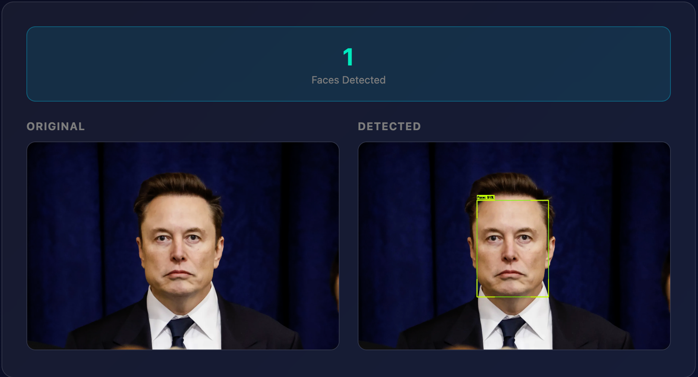
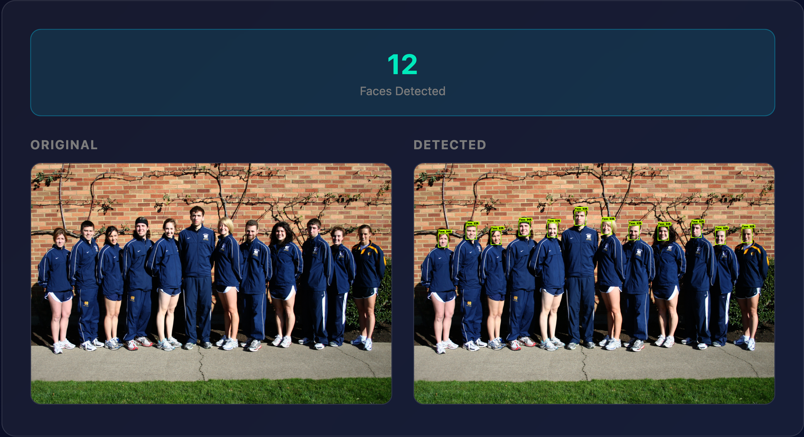
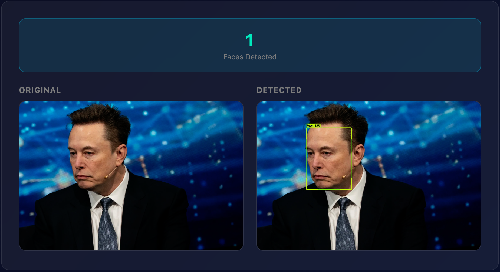
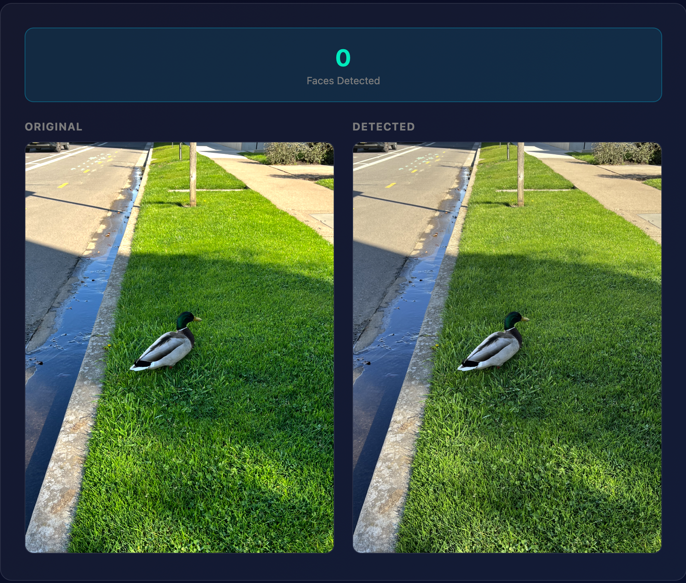
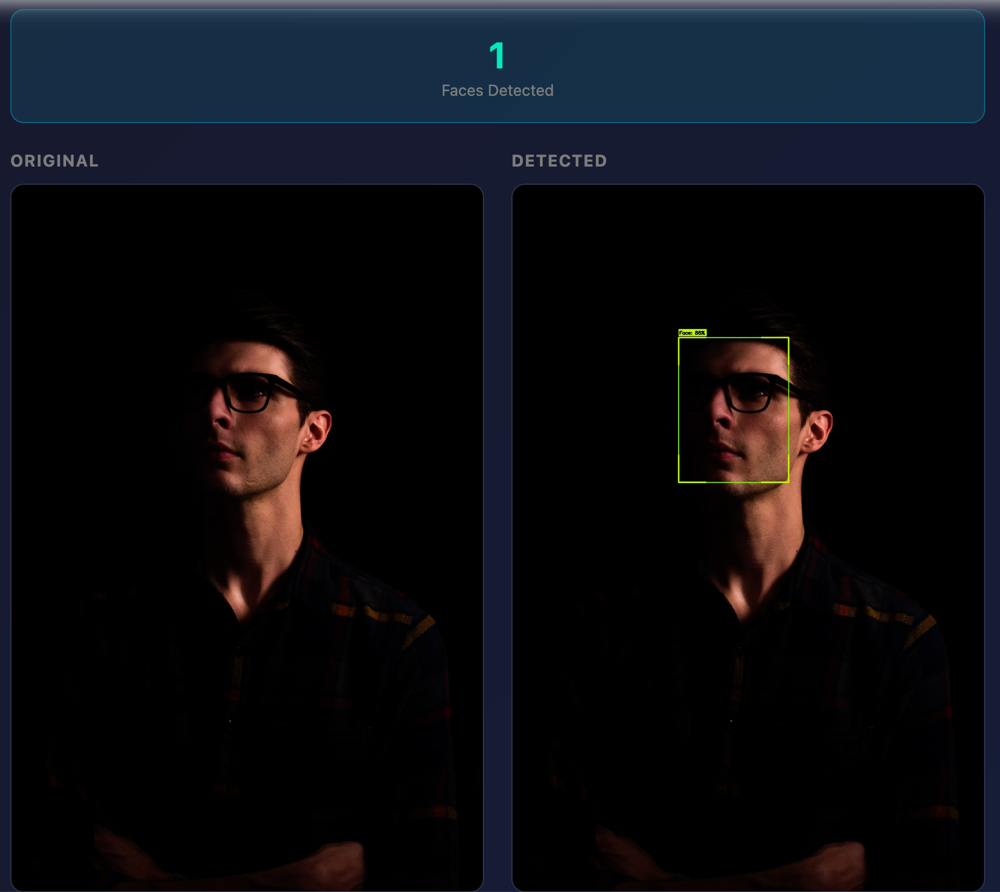
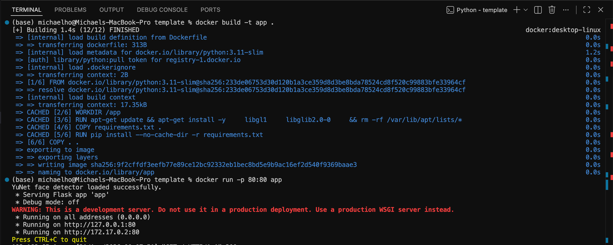

# Final Project
## Description
For my final project, I will try to create an automated Face or Object Detection tool. The application will allow users to upload photos and automatically identify human faces or specific objects by drawing bounding boxes around them.

---

### Design
Containerised using Docker, my project is an automated Face Detection tool built with Flask and OpenCV, powered by YuNet (a deep learning face detector). The application allows users to upload photos and automatically identifies human faces, including frontal, tilted, rotated, and profile views, all in a single inference pass.

Detected faces are highlighted with styled bounding boxes and confidence scores. The application runs in a Docker container for consistent deployment.

---

### Resources
- [YuNet Face Detection Paper](https://link.springer.com/article/10.1007/s11633-023-1423-y)
- [OpenCV Model Zoo](https://github.com/opencv/opencv_zoo)
- [OpenCV FaceDetectorYN Documentation](https://docs.opencv.org/4.x/df/d20/classcv_1_1FaceDetectorYN.html)
- [OpenCV DNN Documentation](https://docs.opencv.org/4.x/d2/d58/tutorial_table_of_content_dnn.html)
- [Flask File Uploads](https://flask.palletsprojects.com/en/stable/patterns/fileuploads/)

---

### AI Usage
I used **Claude** to help me with:
- Structuring my prototyping approach and project timeline
- Identifying appropriate OpenCV functions for face detection
- Understanding which pre-trained models work with `opencv-python-headless`
- Converting the edge detection template to face detection
- Upgrading from Haar Cascades to YuNet for better accuracy
- Integrating OpenCV's FaceDetectorYN API for YuNet inference
- Exaplaning functions for documentation
- Creating the UI with CSS
- Understanding the YuNet output format

---

### Test Results
 
#### Test 1: Single Frontal Face Detection
 
**Input:** Photo with one person facing the camera directly  
**Expected:** Detect 1 face with bounding box and confidence score  
**Result:** Successfully detected 1 face with 91%
confidence ✅
 

 
---
 
#### Test 2: Multiple Faces Detection
 
**Input:** Group photo with multiple people  
**Expected:** Detect all visible faces with individual bounding boxes  
**Result:** Successfully detected [12] faces with individual bounding boxes ✅
 

 
---
 
#### Test 3: Angled/Profile Face Detection
 
**Input:** Photo with face turned to the side (profile view)  
**Expected:** Detect the profile face  
**Result:** Successfully detected profile face ✅
 

 
---
 
#### Test 4: No Faces Present
 
**Input:** Photo without any human faces (landscape/object photo)  
**Expected:** Return 0 faces detected, no bounding boxes drawn  
**Result:** ✅ Correctly returned 0 faces detected. No false positives.
 

 
---
 
#### Test 5: Low Light / Challenging Conditions
 
**Input:** Photo with faces in low light or partial shadow  
**Expected:** Still detect faces despite challenging conditions  
**Result:** YuNet successfully detected faces in difficult lighting scenario ✅
 

 
---
 
#### Test 6: Docker Container Deployment
 
**Input:** Build and run application in Docker container  
**Expected:** Application accessible at http://localhost  
**Result:** Docker container builds and runs successfully ✅
 
```bash
docker build -t app .
docker run -p 80:80 app
```
 

 
---